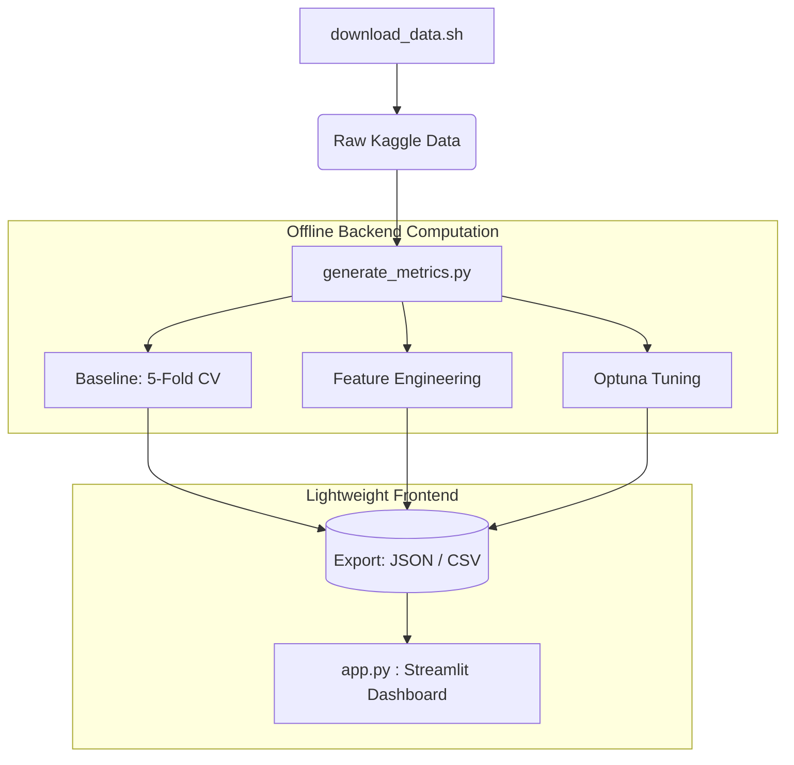

# 🎓 Student Exam Score Predictor (Kaggle S6E1)
**An Interactive ML Journey: From Raw Data to an Optimized XGBoost Regressor**


## 📌 Project Overview
This project goes beyond just building a predictive model for the Kaggle Playground Series (S6E1: Student Test Scores). It is designed as an **Interactive Learning Notebook** deployed via Streamlit.

Instead of deploying a heavy model directly into the web app, this pipeline completely **decouples the backend computation (Cross-Validation, Optuna Tuning) from the frontend visualization**. The result is a lightning-fast dashboard that documents the exact Data Science workflow, complete with mathematical theories and hard-earned lessons.

## 🏗️ Architecture & Decoupled Workflow



## 🚀 Key Takeaways & Lessons Learned

This dashboard isn't just about showing a lower RMSE; it highlights real-world MLOps challenges:

1. **The Correlation Trap:** Features like `sleep_quality` showed near-zero linear correlation with the target. However, the XGBoost feature importance revealed it to be the 2nd most predictive feature. *Lesson: Tree-based models capture non-linear interactions that Pearson correlation completely misses.*
2. **The "Silent Bug" in Data Pipelines:** Defensive programming (`if 'col' in df:`) during the Feature Engineering phase caused the pipeline to silently skip transformations due to a minor typo. *Lesson: Always validate data shapes (e.g., `assert df.shape[1] > old_shape`) to ensure transformations are actually applied.*
3. **Robust Evaluation:** Used **Stratified K-Fold CV** inside the Optuna objective function to ensure hyperparameter configurations generalize well to unseen data, actively preventing overfitting.

## 🛠️ How to Run Locally

This project uses **[uv]()** for blazing-fast dependency management.

**1. Clone the repository and navigate to the directory:**

```bash
git clone [https://github.com/YourUsername/portfolio.git](https://github.com/YourUsername/portfolio.git)
cd portfolio/playground-series-s6e1

```

**2. Fetch the data:**
*(Requires Kaggle CLI configured)*

```bash
chmod +x download_data.sh
./download_data.sh

```

**3. Install dependencies using `uv`:**

```bash
uv pip install -r requirements.txt

```

**4. Generate backend metrics (Heavy lifting):**

```bash
uv run python generate_metrics.py

```

**5. Launch the Streamlit Dashboard:**

```bash
uv run streamlit run app.py

```

## 📂 Repository Structure

* `download_data.sh`: Bash script to automate Kaggle data ingestion.
* `generate_metrics.py`: The core ML pipeline (EDA stats, Baseline, FE, Optuna).
* `app.py`: The lightweight Streamlit dashboard.
* `requirements.txt`: Exported dependencies for Streamlit Community Cloud deployment.
* `*.json` / `*.csv`: Pre-calculated artifacts feeding the dashboard.

## 🌐 Live Demo

You can view the interactive dashboard here: **[Insert Streamlit Cloud URL here after deployment]**


